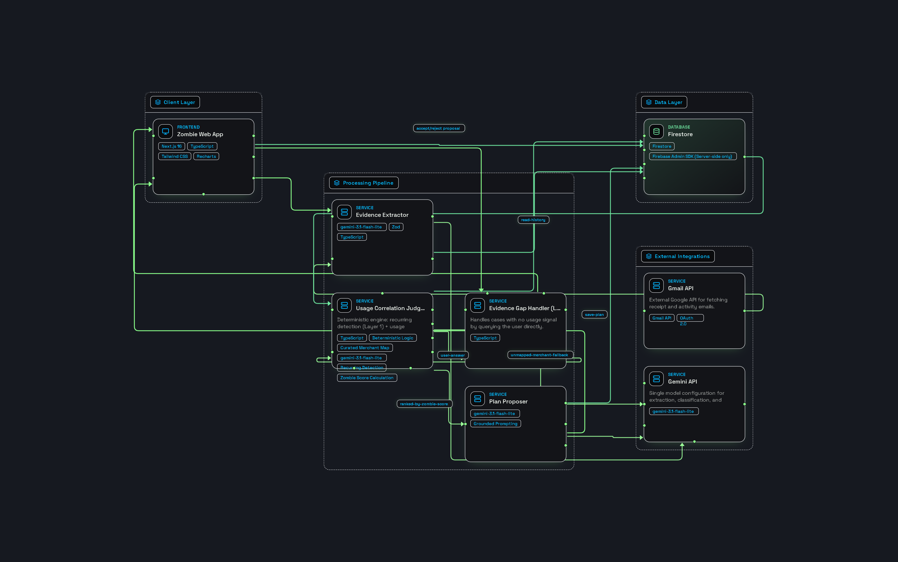

# Zombie — architecture



The system answers one question that recurring-charge detection cannot:
**is this subscription still being used?** Everything below exists to answer it
honestly, including the parts that decline to answer.

---

## The one rule everything else follows

**Gemini never produces a number.**

| | Does |
|---|---|
| **Gemini** | Reads screenshots. Writes the plan's prose. |
| **TypeScript** | Recurring detection. Usage inference. Every verdict. Every rupee. |

An LLM that invents a savings figure is worse than useless in a money product —
it is actively harmful, because the figure looks exactly as trustworthy as a
real one. The separation is enforced three ways: an ESLint rule that forbids the
engine from importing Zod, firebase-admin, Gemini, React or Next; a proposal
response schema with **no numeric field for a number to arrive in**; and a
scan that discards any generated text containing a figure that was not supplied.

---

## Layers

### Layer 1 — Recurring detection · `src/lib/subscriptions.ts`

Same merchant, 25–35 day cadence, amount within ±10%, three or more
occurrences. Walks backwards from the most recent charge, skipping extra
same-month purchases, and keeps the current unbroken streak.

Table stakes — every bank app does this. It is here only because scoring needs
the **full charge chain** with per-charge traceability: `firstDate`, `lastDate`,
`totalPaid`, `chargeIds`, `charges`.

Two decisions worth knowing:

- **Grouping is by `merchantKeyOf`, not the raw payee string.** Real GPay names
  drift between billing cycles (`AMAZON PRIME` → `Amazon Prime*IN`). Grouping on
  the raw string splits one seven-charge chain into two three-charge chains and
  shows two cards, each with half the money.
- **Charges are emitted ascending with an id tie-break.** This makes "charges
  after the last usage" a contiguous *tail slice*, which converts a subtle
  filter into a checkable invariant — and makes `chargeIds` reproducible.

### Layer 2 — Usage correlation · `src/lib/correlate.ts`, `src/lib/merchant-map.ts`

The differentiator. Many subscriptions leave a transaction footprint when
genuinely used: Amazon Prime → Amazon orders, Swiggy One → Swiggy orders. Zero
correlated activity across the 90-day lookback means likely unused.

#### The self-validation trap

An "Amazon Prime" charge matches the usage pattern `amazon`. Without precedence,
every subscription cites its own monthly bill as proof that it is being used,
every verdict comes back `used`, and the app reports **zero zombies** — with no
error, no exception, and a perfectly reasonable-looking screen. It fails
silently and it fails completely.

`isUsageEvidence()` runs four steps, and their order *is* the contract:

1. Is this one of **this subscription's own** charges? → not evidence.
2. Does this service have no observable footprint? → nothing is evidence.
3. Does it look like **any** subscription charge in the whole map? → not evidence.
4. Does it match this service's usage patterns? → evidence.

Step 3's global scope is the subtle half. An Amazon Prime charge that Layer 1
failed to chain — two occurrences, or a broken cadence — is not in the exclusion
set, so step 1 lets it through. Step 3 is the only thing between it and a `used`
verdict. Narrowing it to this entry's own patterns would happen to work for
Prime, but would let an "Amazon Music" charge validate Prime instead.

Step 1 is deliberately scoped to the subscription's own chain rather than every
detected chain. Three similar monthly Amazon purchases chain into their own
recurring pattern; excluding them globally would strike genuine Amazon activity
from Prime's evidence and flag an **actively used** Prime as a zombie. A false
zombie is the worst failure this product has.

Matching is on **contiguous token sequences**, not substrings — `ola` sits
inside "Chocolate Room".

### Layer 2c — The evidence gap handler

Twelve of the twenty-one mapped services leave no financial trace when used:
Netflix, Spotify, cloud storage. That is not a gap in the research, it is the
honest shape of the domain.

Two different kinds of not-knowing, kept structurally distinct because they are
not the same admission:

| | In the map? | Confidence | Question from |
|---|---|---|---|
| **No footprint** (Netflix) | Yes | `low` | A hand-written question on the entry |
| **Unmapped** (Kuku FM) | No | `none` | A generic template |

Both get `verdict: "unknown"` and **`zombieScore: 0`**. No evidence means no
claim, and unanswered unknowns contribute exactly zero to both headline totals.
The type system enforces the invariant: a footprint-less entry without a
question does not compile.

### Layer 3 — Zombie score and proposal

```
zombieScore   = sum of the actual charges billed AFTER the last usage evidence
              (every charge, if usage was never seen)
totalWasted   = sum of every zombieScore
annualSavings = 12 × the monthly cost of every likely-unused subscription
```

The unit is rupees and every rupee carries a transaction id, so the headline
reconciles against the charge history **by construction** rather than by trust.

This refines the PRD's `months idle × monthly cost`. The two are not the same
number: Prime at 192 days idle is 6.4 months × ₹299 = ₹1,913, and only
reproduces the auditable ₹2,093 if you happen to round up. Sum-of-charges gives
₹2,093 and ₹800 exactly.

#### The distinction that decides the money

Two different questions, answered from two different ranges. Conflating them is
the single most likely source of a wrong number:

| | Question | Range | Drives |
|---|---|---|---|
| **Window** | "Any usage in the last 90 days?" | `[asOf−90, asOf]` | verdict, confidence |
| **Last usage** | "*When* did usage last happen?" | **All history** | zombieScore |

Zomato Gold separates them: the last order is 115 days ago — outside the window,
so the verdict is `likely-unused` — but the score must be bounded by that order,
not by the window. Derive last-usage from the window-filtered list instead and
it returns null, the never-used branch fires, and the figure doubles from ₹800 to
₹1,600 with no error and a plausible evidence chain.

The evidence chain therefore carries `matchesInWindow` and `lastUsage` as
**separate fields**, and the UI renders both, so a discrepancy would be visible
on screen rather than silent.

---

## Confidence

Rendered as a word, never a percentage — fake precision would undercut the
honesty the product argues for. There is **no numeric confidence field in the
type at all**, which is the cheapest way to guarantee one never reaches the
screen.

| Grade | Means |
|---|---|
| `high` | In-window evidence, or a full 90-day silence |
| `medium` | The dataset is shorter than 90 days, so the silence claim rests on less |
| `low` | Recognised service, no observable footprint |
| `none` | Merchant not recognised |
| `user-confirmed` | The user told us, and that outranks every inference |

---

## Data flow

```
GPay screenshot ──► Gemini (transcribe) ──► Zod ──► transactions
                                                        │
                                                        ▼
                                            Layer 1: charge chains
                                                        │
                                                        ▼
                                    Layer 2: correlate against merchant map
                                             │                    │
                                    evidence found        no footprint
                                             │                    │
                                             ▼                    ▼
                                    Layer 3: score        gap handler ──► user
                                             │                    │
                                             └────────┬───────────┘
                                                      ▼
                                        proposal (figures from code,
                                             prose from Gemini)
                                                      │
                                                      ▼
                                              accept / reject
```

## Storage

One interface, two implementations, selected on whether a service account is
actually **readable** — not merely whether the variable is set, because
`.env.example` ships with the path pre-filled.

- **Firestore** (`firebase-admin`, server-side only; no client SDK, no security
  rules): `transactions/{id}`, `verdicts/{merchantKey}`, `proposals/{id}`.
- **Local JSON** (`./data/zombie.json`) otherwise, so a clean clone runs and the
  demo works before anyone opens the Firebase console.

## Surfaces

| Route | Purpose |
|---|---|
| `/` | Server-rendered dashboard. Headline, ranked cards, evidence chains, gap queue, plan. |
| `POST /api/extract` | Screenshot → transactions |
| `POST /api/verdicts/{key}/answer` | Record a gap-handler answer |
| `POST /api/proposal` | Generate a plan · `PATCH` to accept or reject |

The dashboard's own controls use **server actions**, not these routes. The
routes are gated by an owner passcode, and handing that passcode to the browser
so the browser can hand it back would be theatre rather than authentication.

## Deliberately out of scope

Autonomous cancellation (the agent proposes, the human disposes — a permanent
product principle), multi-user accounts, bank and app-store API integration,
device telemetry, and a conversational interface. The UI *is* the evidence
chain.
