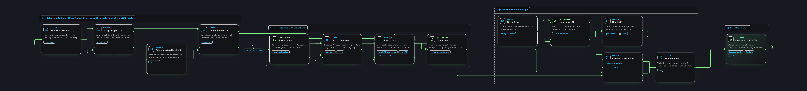

# Zombie — architecture



The system answers one question that recurring-charge detection cannot:
**is this subscription still being used?** Everything below exists to answer it
honestly, including the parts that decline to answer.

---

## The one rule everything else follows

**Gemini never produces a number.**

| | Does |
|---|---|
| **Gemini** | Reads screenshots and billing email. Writes the plan's prose and chat replies. |
| **TypeScript** | Recurring detection. Usage inference. Every verdict. Every rupee. |

An LLM that invents a savings figure is worse than useless in a money product —
it is actively harmful, because the figure looks exactly as trustworthy as a
real one. The separation is enforced three ways: an ESLint rule that forbids the
engine from importing Zod, firebase-admin, Gemini, React or Next; a proposal
response schema with **no numeric field for a number to arrive in**; and a
scan that discards any generated text containing a figure that was not supplied.

That last scan guards **both** generated surfaces. The plan and the chat reply
run through the same `foreignNumbers` check against the same allow-list of
engine-computed figures, and both discard the whole output rather than the
offending sentence — a half-retracted paragraph about money is worse than none.

---

## Layers

### Layer 1 — Recurring detection · `src/lib/subscriptions.ts`

Same merchant, 25–35 day cadence, amount within ±10%, three or more
occurrences. Walks backwards from the most recent charge, skipping extra
same-month purchases, and keeps the current unbroken streak.

Table stakes — every bank app does this. It is here only because scoring needs
the **full charge chain** with per-charge traceability: `firstDate`, `lastDate`,
`totalPaid`, `chargeIds`, `charges`.

Two decisions worth knowing:

- **Grouping is by `merchantKeyOf`, not the raw payee string.** Real GPay names
  drift between billing cycles (`AMAZON PRIME` → `Amazon Prime*IN`). Grouping on
  the raw string splits one seven-charge chain into two three-charge chains and
  shows two cards, each with half the money.
- **Charges are emitted ascending with an id tie-break.** This makes "charges
  after the last usage" a contiguous *tail slice*, which converts a subtle
  filter into a checkable invariant — and makes `chargeIds` reproducible.

### Layer 2 — Usage correlation · `src/lib/correlate.ts`, `src/lib/merchant-map.ts`

The differentiator. Many subscriptions leave a transaction footprint when
genuinely used: Amazon Prime → Amazon orders, Swiggy One → Swiggy orders. Zero
correlated activity across the 90-day lookback means likely unused.

#### The self-validation trap

An "Amazon Prime" charge matches the usage pattern `amazon`. Without precedence,
every subscription cites its own monthly bill as proof that it is being used,
every verdict comes back `used`, and the app reports **zero zombies** — with no
error, no exception, and a perfectly reasonable-looking screen. It fails
silently and it fails completely.

`isUsageEvidence()` runs four steps, and their order *is* the contract:

1. Is this one of **this subscription's own** charges? → not evidence.
2. Does this service have no observable footprint? → nothing is evidence.
3. Does it look like **any** subscription charge in the whole map? → not evidence.
4. Does it match this service's usage patterns? → evidence.

Step 3's global scope is the subtle half. An Amazon Prime charge that Layer 1
failed to chain — two occurrences, or a broken cadence — is not in the exclusion
set, so step 1 lets it through. Step 3 is the only thing between it and a `used`
verdict. Narrowing it to this entry's own patterns would happen to work for
Prime, but would let an "Amazon Music" charge validate Prime instead.

Step 1 is deliberately scoped to the subscription's own chain rather than every
detected chain. Three similar monthly Amazon purchases chain into their own
recurring pattern; excluding them globally would strike genuine Amazon activity
from Prime's evidence and flag an **actively used** Prime as a zombie. A false
zombie is the worst failure this product has.

Matching is on **contiguous token sequences**, not substrings — `ola` sits
inside "Chocolate Room".

### Layer 2b — Email intake and evidence · `src/lib/gmail.ts`

Gmail is read in **both directions**, and the two jobs are worth keeping apart:

- **Intake.** A billing email's body goes through Gemini and the *same Zod
  schema a screenshot uses*, and becomes a transaction with a real amount,
  tagged `Source = mail` on the dashboard. This is why the scope is
  `gmail.readonly`: an amount lives in the message body, and `gmail.metadata`
  returns headers only. No narrower scope can do this job.
- **Evidence.** `isEmailUsageEvidence()` treats an order confirmation or
  dispatch notice as proof of use.

The evidence half mirrors Layer 2's precedence exactly, because it inherits
Layer 2's trap: a Netflix *receipt* would otherwise prove Netflix is being
watched. Billing subjects are therefore matched and excluded **before** any
usage subject is considered, and the sender must match the entry's known
senders. Same failure mode, same shape of defence.

Sync is filtered by Gmail **label id**. There is no label-scoped OAuth scope in
existence — the grant is mailbox-wide — so this filter is a promise the code
keeps rather than one Google enforces, and the README and PRD both say so
rather than implying a tighter permission than the app actually holds.

### Layer 2c — The evidence gap handler

Twenty-four of the thirty-two mapped services leave no financial trace when
used: Netflix, Spotify, cloud storage, most AI and developer tooling. That is
not a gap in the research, it is the honest shape of the domain — and it is why
the gap handler is a headline feature rather than a fallback.

Two different kinds of not-knowing, kept structurally distinct because they are
not the same admission:

| | In the map? | Confidence | Question from |
|---|---|---|---|
| **No footprint** (Netflix) | Yes | `low` | A hand-written question on the entry |
| **Unmapped** (Kuku FM) | No | `none` | A generic template |

Both get `verdict: "unknown"` and **`zombieScore: 0`**. No evidence means no
claim, and unanswered unknowns contribute exactly zero to both headline totals.
The type system enforces the invariant: a footprint-less entry without a
question does not compile.

### Layer 3 — Zombie score and proposal

```
zombieScore   = sum of the actual charges billed AFTER the last usage evidence
              (every charge, if usage was never seen)
totalWasted   = sum of every zombieScore
annualSavings = 12 × the monthly cost of every likely-unused ACTIVE subscription
monthlyRunRate= the monthly cost of every ACTIVE subscription
```

`active` is load-bearing in both of the last two. A subscription the user has
ticked as cancelled, or one that stopped billing more than 40 days ago, is not a
future saving — counting it would let the headline grow every time the user
acted on the advice.

The unit is rupees and every rupee carries a transaction id, so the headline
reconciles against the charge history **by construction** rather than by trust.

This refines the PRD's `months idle × monthly cost`. The two are not the same
number: Prime at 192 days idle is 6.4 months × ₹299 = ₹1,913, and only
reproduces the auditable ₹2,093 if you happen to round up. Sum-of-charges gives
₹2,093 and ₹800 exactly.

#### The distinction that decides the money

Two different questions, answered from two different ranges. Conflating them is
the single most likely source of a wrong number:

| | Question | Range | Drives |
|---|---|---|---|
| **Window** | "Any usage in the last 90 days?" | `[asOf−90, asOf]` | verdict, confidence |
| **Last usage** | "*When* did usage last happen?" | **All history** | zombieScore |

Zomato Gold separates them: the last order is 115 days ago — outside the window,
so the verdict is `likely-unused` — but the score must be bounded by that order,
not by the window. Derive last-usage from the window-filtered list instead and
it returns null, the never-used branch fires, and the figure doubles from ₹800 to
₹1,600 with no error and a plausible evidence chain.

The evidence chain therefore carries `matchesInWindow` and `lastUsage` as
**separate fields**, and the UI renders both, so a discrepancy would be visible
on screen rather than silent.

#### Cancellation, and the guard behind it

A user can tick an item once they have actually cancelled it. That removes it
from the run rate and from annual savings, and surfaces a "you've saved" figure
in the present month and every month after.

`applyCancellation()` then does the part that matters: it looks for charges
dated **after** the cancellation and, if it finds any, puts the subscription
back to `active` and lists the offending charges. Cancellations fail in real
life — a "cancel" that only paused, an autopay mandate that outlived the
account. An agent that keeps congratulating the user for a saving that silently
stopped happening is worse than one that never tracked it at all, so the tick is
treated as a *claim to be checked* rather than a fact to be trusted.

---

## The time machine

`analyze(transactions, asOf?)` takes the evaluation date as an argument rather
than reading the clock. That one parameter buys three things:

1. **Deterministic tests.** Every one of the 100 checks pins `asOf`, so the
   suite cannot drift into failure overnight.
2. **A demo that never goes stale.** Seeded dates are generated relative to the
   run date, and the demo figures are asserted at four anchor dates through
   March 2027.
3. **The month navigator.** Paging back to April re-runs the *entire engine* as
   of 30 April — so April shows the verdicts the agent would genuinely have
   reached in April, not today's verdicts filtered by date. A subscription used
   then and abandoned since correctly reads `used` in April and
   `likely-unused` now.

Point 3 works only because verdicts are **computed on every request and never
persisted**. Storing them would make the history a log of what the agent once
said, rather than a re-derivation of what the evidence supports.

---

## The chat assistant · `src/lib/chat.ts`, `src/lib/chat-service.ts`

Stateless, and deliberately incapable of out-running the dashboard.

The order of operations is the whole design: the engine runs first,
`buildChatContext()` freezes the resulting figures, a **deterministic answer is
computed before Gemini is called at all**, and only then is the model asked to
phrase things. If the reply contains a number outside the allow-list, the reply
is discarded and the pre-computed answer ships instead — which is why the fallback
exists before the request rather than after the failure.

Replies are not streamed. The guard has to see a complete answer before it can
judge it, and a sentence about money that might have to be retracted mid-flow is
worse than one that arrives a second later, whole. The typewriter effect in the
UI is therefore cosmetic: it reveals text that has already been validated.

---

## Confidence

Rendered as a word, never a percentage — fake precision would undercut the
honesty the product argues for. There is **no numeric confidence field in the
type at all**, which is the cheapest way to guarantee one never reaches the
screen.

| Grade | Means |
|---|---|
| `high` | In-window evidence, or a full 90-day silence |
| `medium` | The dataset is shorter than 90 days, so the silence claim rests on less |
| `low` | Recognised service, no observable footprint |
| `none` | Merchant not recognised |
| `user-confirmed` | The user told us, and that outranks every inference |

---

## Data flow

```
GPay screenshot ─┐
                 ├─► Gemini (transcribe) ──► Zod ──► transactions
labelled Gmail ──┘                                       │
      │                                                  ▼
      └──► email events ────────────────────► Layer 1: charge chains
                     │                                   │
                     │                                   ▼
                     └───────────► Layer 2 / 2b: correlate against merchant map
                                             │                    │
                                    evidence found        no footprint
                                             │                    │
                                             ▼                    ▼
                                    Layer 3: score        gap handler ──► user
                                             │                    │
                                             └────────┬───────────┘
                                                      ▼
                                        proposal (figures from code,
                                             prose from Gemini)
                                                      │
                                                      ▼
                                              accept / reject
                                                      │
                                                      ▼
                                        answers · cancellation ticks
                                                      │
        ┌─────────────────────────────────────────────┘
        └──► back into the next analyze() run, outranking inference
```

The last arrow is the one that makes this an agent rather than a report
generator. User answers and cancellation ticks are inputs to the *next* run, not
annotations on the last one — which is why nothing the engine concludes is ever
stored, and why a cancellation can be overturned by a charge that arrives after
it.

## Storage

One interface, two implementations, selected on whether a service account is
actually **readable** — not merely whether the variable is set, because
`.env.example` ships with the path pre-filled.

- **Firestore** (`firebase-admin`, server-side only; no client SDK, no security
  rules): `transactions/{id}`, `verdicts/{merchantKey}`,
  `cancellations/{merchantKey}`, `proposals/{id}`, `emails/{id}`,
  `usage/{date}` (quota counters) and `config/gmailToken`.
- **Local JSON** (`./data/zombie.json`) otherwise, so a clean clone runs and the
  demo works before anyone opens the Firebase console.

Note what is **not** in that list: subscriptions and verdicts. The `verdicts`
collection holds the user's *answers* — the name is legacy — and nothing the
engine concludes is ever written down. Everything on screen is re-derived from
raw transactions on each request, which is what makes the month navigator and
the cancellation guard possible.

Reads pass through a 10-second write-invalidated cache. That is not a
performance flourish: Firestore's free tier allows 50,000 reads a day, a
dashboard render costs several, and an exhausted quota takes the site down
mid-demo. When the store does fail, the app renders an explanation at HTTP 200
rather than a stack trace.

### The two-track rule

Real financial data must never reach the public deployment. Enforced by tooling
rather than by memory:

- `ZOMBIE_STORE=local` forces the JSON store **even when Firebase credentials
  are present**, so dogfooding cannot leak upward.
- `npm run demo:reset` clears real transactions, answers, cancellations, synced
  mail and proposals, re-seeds, and **exits non-zero if any figure drifts** from
  the expected demo outcome.

The alternative — moving a service-account file around to change behaviour — is
exactly the kind of manual step that gets forgotten with real financial data on
the wrong side of it.

## Surfaces

| Route | Purpose |
|---|---|
| `/` | Server-rendered dashboard. Headline, ranked cards, evidence chains, gap queue, plan. |
| `/upload` | Screenshot intake |
| `POST /api/extract` | Screenshot → transactions |
| `POST /api/verdicts/{key}/answer` | Record a gap-handler answer |
| `POST /api/proposal` | Generate a plan · `PATCH` to accept or reject · `GET` for the latest |
| `GET /api/gmail/auth` · `/callback` | OAuth handshake |
| `POST /api/gmail/sync` | Read labelled mail → bills and usage evidence |

The dashboard's own controls use **server actions**, not these routes — the
chat assistant and the Gmail connect flow included. The routes are gated by an
owner passcode, and handing that passcode to the browser so the browser can hand
it back would be theatre rather than authentication.

## Deliberately out of scope

Autonomous cancellation (the agent proposes, the human disposes — a permanent
product principle), multi-user accounts, bank and app-store API integration, and
device telemetry.

A conversational interface *was* on this list, on the reasoning that the UI is
the evidence chain and chat adds nothing analytical. That reasoning still holds
— the assistant cannot reach a conclusion the dashboard does not already show —
but it was the wrong conclusion to draw from it. Chat adds reach, not analysis:
asking costs less than reading three tiles. It shipped constrained accordingly,
and the constraint is what makes it defensible in a money product.
